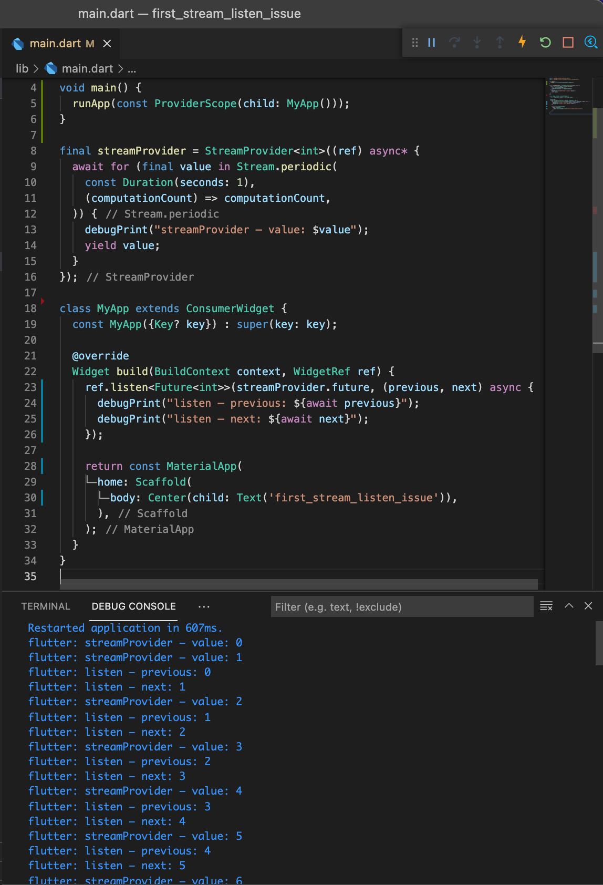

# first_stream_listen_issue

## Issue

[WidgetRef.listen](https://pub.dev/documentation/flutter_riverpod/latest/flutter_riverpod/WidgetRef/listen.html) does not catch first yield from a StreamProvider

## Reproduction

See [main.dart](./lib/main.dart).



## Expectation

I expect listener() to be called as soon as the first value is yielded from the stream:

```text
Restarted application in 607ms.
flutter: streamProvider – value: 0
flutter: listen – previous: null
flutter: listen – next: 0
flutter: streamProvider – value: 1
flutter: listen – previous: 0
flutter: listen – next: 1
[...]
```

However, listener() is. called only once two values are yield by the stream:

```text
Restarted application in 607ms.
flutter: streamProvider – value: 0
flutter: streamProvider – value: 1
flutter: listen – previous: 0
flutter: listen – next: 1
[...]
```

## Solution

<https://github.com/rrousselGit/river_pod/issues/1262#issuecomment-1060751077>
